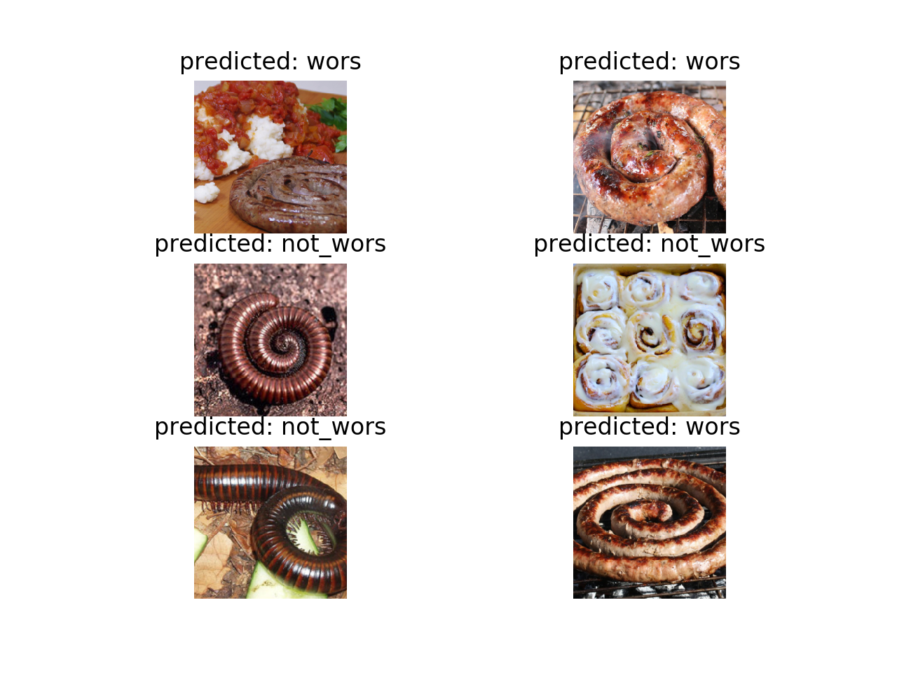

# Not-Wors
### Boerewors Classification using ResNets and Transfer Learning

Inspired by the [hotdog/not-hotdog classifier](https://www.youtube.com/watch?v=mrk95jFVKqY) from HBO’s Silicon Valley S4E4.
 

# Example of Results
Fixed feature extractor trained (with transfer learning) on only ~380 images for only 2 epochs. 



# Installation

```bash
git clone https://github.com/gianlucatruda/not-wors.git
cd not-wors
pip3 install -r requirements.txt
```

# Usage
To run a demo, place any two pictures you like in ```/boeriebase/demo/unlabelled/``` and run:

```bash
python3 inference.py models/ffe_1013.model demo
```

To run evaluation, simply run:

```bash
python3 inference.py models/ffe_1013.model val
```

# Contributors
* [Gianluca Truda](https://github.com/gianlucatruda)
* [Zak Toyer](https://github.com/zed925)
* [Luke Neville](https://github.com/Nevter)
* [Robbie Barnhoorn](https://github.com/RobbieBarnhoorn)
* [Luke Taylor](https://github.com/webstorms)

# Acknowledgments
The code for this project is a significantly adapted version of the code presented in [this tutorial](https://pytorch.org/tutorials/beginner/transfer_learning_tutorial.html#sphx-glr-beginner-transfer-learning-tutorial-py), for which we thank Sasank Chilamkurthy.


# Disclaimer
The images in ```boeriebase/``` were scraped from Google Images and Instagram. They are used for demonstration purposes only and do not fall under the same [licence terms](LICENSE) as the source code. The authors do not own the rights to the images.
